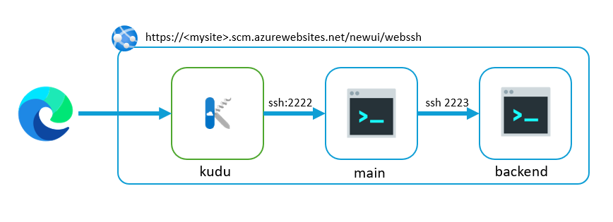
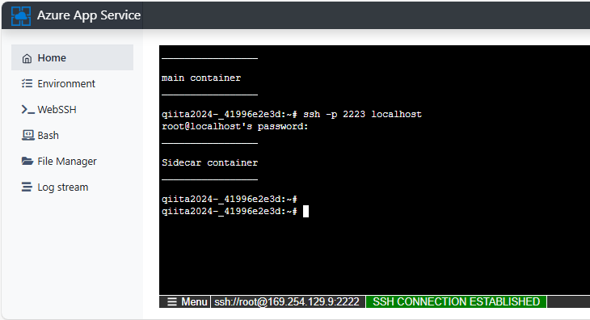

# SSH connection to sidecar

## Setup
- Confiugre `main` container to use 2222 port based on [Offical Guideline](https://learn.microsoft.com/en-us/azure/app-service/configure-custom-container?tabs=debian&pivots=container-linux#enable-ssh).
- Configure `sidecar` container to use 2223(non 2222) port for its own sshd.

## How to use

- Open Kudu WebUI and then navigate to WebSSH menu (https://<SiteName>.scm.azurewebsites.net/newui/webssh)
- WebSSH will connect to `main` container with port 2222.
- `ssh -p 2223 localhost` then type password `Docker!` (defined in sidecat/sshd_config)
